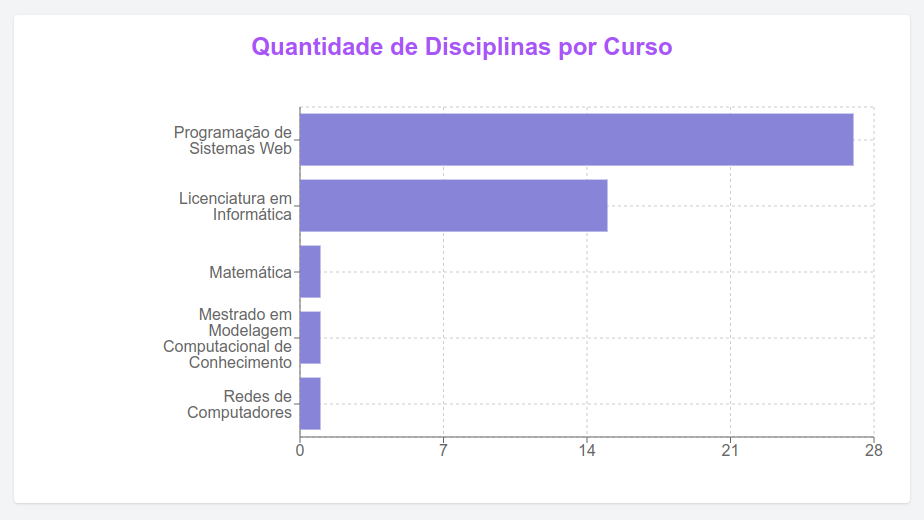

# Exercício: Criação de Gráfico de Barras Horizontais com Recharts e Next.js

## Objetivo

O objetivo deste exercício é aplicar conceitos de integração entre frontend e backend em uma aplicação web utilizando **Next.js**, **TailwindCSS** e **Recharts** para exibir dados provenientes de uma **API REST** em um **gráfico de barras horizontais**. Você deverá exibir a quantidade de disciplinas ofertadas por curso em uma tela.

## Requisitos

1. Criar uma aplicação Next.js configurada com TailwindCSS.
2. Integrar a aplicação com a API REST fornecida.
3. Utilizar a biblioteca Recharts para construir um gráfico de barras horizontais que exiba a quantidade de disciplinas ofertadas por curso.
4. Garantir que os nomes dos cursos sejam exibidos em uma única linha, sem quebras, e que o layout esteja bem formatado.
5. Centralizar o título da página.

## Passos

1. **Criação do Projeto Next.js**:
   - Inicie um novo projeto Next.js utilizando `npx create-next-app@latest` e navegue até o diretório do projeto.
   - Instale o TailwindCSS e configure conforme as instruções da [documentação oficial](https://tailwindcss.com/docs/installation).

2. **Instalação de Dependências**:
   - Instale a biblioteca `Recharts` para criar o gráfico de barras:
     ```bash
     npm install recharts
     ```

3. **Configuração da API REST**:
4. - O aluno já deve ter configurado sua própria API REST

5. **Criação do Componente de Gráfico**:
   - No arquivo `pages/index.tsx`, você deverá implementar o código para exibir o gráfico de barras horizontais usando os dados da API REST. Utilize a biblioteca `Recharts` para gerar o gráfico.
   - **Dicas**:
     - Utilize o componente `BarChart` da biblioteca `Recharts`.
     - Configure o layout para que o gráfico seja horizontal (`layout="vertical"`).
     - Adicione margens adequadas para que o nome dos cursos não quebre linhas.
     - Centralize o título da página com TailwindCSS (`text-center`).

6. **Personalização**:
   - Aumente a margem esquerda (`left`) para garantir que os nomes dos cursos tenham espaço suficiente para serem exibidos.
  

## Resultado Final

 